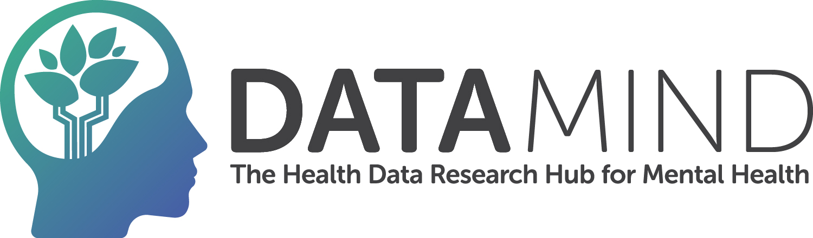

Welcome to DATAMIND, UK's Health Data Research Hub for Mental Health. DATAMIND works to make best use of UK's rich mental health data and enable coordinated research. Detailed information about DATAMIND is available at [www.datamind.org.uk](www.datamind.org.uk). 

# What is DATAMIND-UK?

DATAMIND-UK is DATAMIND’s official GitHub Organization account. The term *organization* comes from GitHub’s lexicon and refers to the type of GitHub account, and not to DATAMIND’s structural organization as a Hub (team, partners, etc). Therefore, it is important to differentiate between DATAMIND-UK ([GitHub Organization account](https://github.com/DATAMIND-UK)) and DATAMIND ([the Hub itself](https://datamind.org.uk/about-us/)).

DATAMIND-UK aims to bring together a community of researchers and developers working (or simply interested) on mental health data science, while fostering discussion, collaboration and open science. This applies to everyone, both inside and outside of DATAMIND.

# Why being part of DATAMIND-UK?

You can find general information about GitHub Organizations [here](https://docs.github.com/en/organizations/collaborating-with-groups-in-organizations/about-organizations). However, some of the main benefits we would like to highlight are:
- *Community:* Access to a community of researchers and developers with a shared pations for mental health data science.
- *Early access:* Early access to mental health data science projects when project owners decide to share their repositories with DATAMIND-UK members, regardless of general public access policy.
- *Team access control:* GitHub Organizations allows you to create teams and sub-teams, defining clear and organized structures, and simplifying the management of access for people.

# Why adding repositories to DATAMIND-UK?

- *Visibility*: Increasing the visibility of your project to a very relevant community.
- *Team access control:* GitHub Organizations allows you to create teams and sub-teams, defining clear and organized structures, and simplifying the management of access for people.

# How can I be added to DATAMIND-UK?

If you wish to be added as a member of DATAMIND-UK, complete the [membership form](https://github.com/DATAMIND-UK/.github/raw/refs/heads/main/docs/membership_form.docx) and send it to [datamind@swansea.ac.uk](mailto:datamind@swansea.ac.uk) with subject *“[GitHub] Organization Access”*. 

# Contact

You can contact us at [datamind@swansea.ac.uk](mailto:datamind@swansea.ac.uk).
